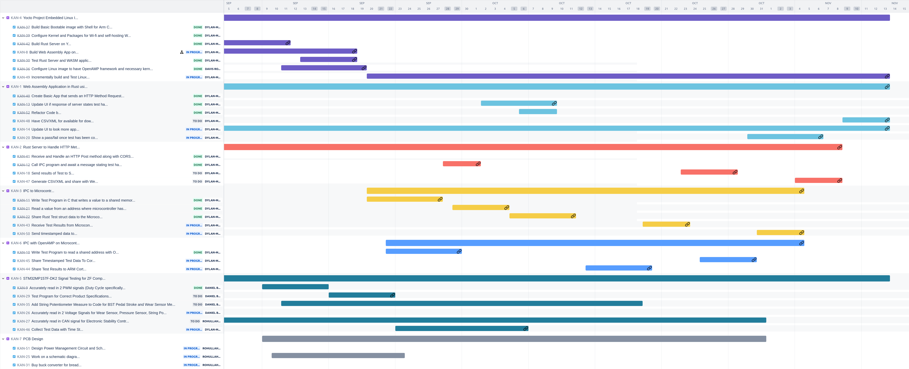
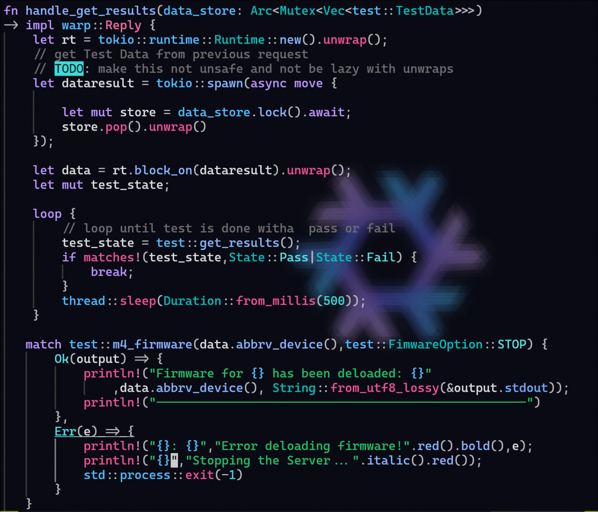

----
marp: true
theme: uncover
backgroundColor: black
color: cyan
paginate: true  # Optional: Add page numbers
style: |
  .columns {
    display: grid;
    grid-template-columns: repeat(2, minmax(0, 1fr));
    gap: 1rem;
  }
  section {
    font-size: 18px;
  }
  h1 {
    font-size: 28px;
  }
  h2 {
    font-size: 24px;
  }
  h3 {
    font-size: 22px;
  }
    code:not([class]) {
    background-color: black;
    color: #00ff00;
    padding: 0.2em 0.4em;
    border-radius: 3px;
    font-family: monospace;
    font-size: 0.9em;
  }
  pre {
    background-color: black;
    padding: 1em;
    border-radius: 5px;
  }
  pre code {
    color: #00ff00;
    padding: 0;
  }

----
# ECE4820 Senior Design II: Presentation 4
## Gantt Chart Progress, Updated Budget Projection, Progress Report

## Members
- Dylan-Matthew Garza
- Daniel Baker
- Rohullah Sah

## Advisor
 Dr. Janos Grantner

## Sponsor

 ZF Group

**Date**: October 11 2024

----

# Gantt Chart Update (1/2)

----

# Budget Projections Update

----

# Progress Report - Daniel Baker & Rohullah Sah

## Power Supply Management 
- Finalized 12V DC power source design with adjustable power jack
- Implemented Mini360 buck converter for voltage regulation
- Created dedicated board for peripheral power distribution
- Developed dual-output power supply (12V DC and 5V DC)

----

----

# Progress Report - Daniel Baker & Rohullah Sah (cont.)

## Peripheral PCB Development
- 12V DC: String Potentiometer, Pressure Sensor, Brake Signal Transmitter
- 5V DC: Wear Sensor
- 3.3V DC: STM32 microcontrollers (for safer operation)
- LM7805 voltage regulator used for 5V DC conversion

----

# Progress Report - Daniel Baker & Rohullah Sah (cont.)

    

        
    

    

        
    

----

# Progress Report - Daniel Baker & Rohullah Sah (cont.)

<video controls src="../Demo_Videos/October11/pcbdemo1.mp4" type="video/mp4" height="500px">

----

# Progress Report - Dylan-Matthew Garza

## Web Assembly

- Refactored entire Codebase 
    - still using same framework (Yew using Rust)

- Handling state update from server
    - asynchronously showing state
- Periodically pings server to check if it is connected
    - sends `GET` request at a path
- Once test is initiated, application sends `GET` request
    - UI should indicate if test is still in progress
    - once results are available show pass or fail

## Webserver
- handles `GET` to show server status once running
- Pings micrcontroller when test is running
    - checks every 500ms to see if test is done running
    - sends response to client once it shows pass or fail
----

# Progress Report - Dylan-Matthew Garza (cont.)
## Microcontroller
- Properly sending and receiving messages
- Writing to a file on linux filesytem for logging
    - using a csv style format (with timestamps)
    - Max size of about 1.2kB (about 2900 entries)
    - located under
    `/sys/kernel/debug/remoteproc/remoteproc0/trace0`

----

# Web Assembly with Yew using Component Interface

----

# Webserver

----

# Webserver (cont.)

----

# Microcontroller 

----

# Screenshots (screen recording didn't work)

    

        <image src="../Images/October11/ui0.png" width="500px">
    

    

        <image src="../Images/October11/ui1.png" height="300px">
        <image src="../Images/October11/cns1.png" width="500px">
    

----

# Screenshots (cont.)

    

        <image src="../Images/October11/ui2.png" 
        width="500px">
    

    

        <image src="../Images/October11/cns2.png"
        width="600px">
    

