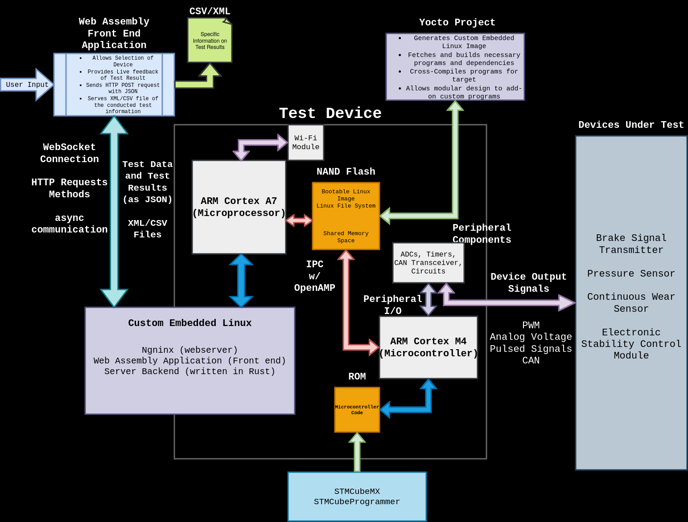

----
marp: true
theme: uncover
backgroundColor: black
color: white
paginate: true  # Optional: Add page numbers
style: |
  .columns {
    display: grid;
    grid-template-columns: repeat(2, minmax(0, 1fr));
    gap: 1rem;
  }
  section {
    font-size: 14px;
  }
  h1 {
    font-size: 21px;
  }

----
# ECE4820: Senior Design II Project Overview

**Members**
- Dylan-Matthew Garza
- Daniel Baker
- Rohullah Sah

**Date:** September 06 2024

----
## Project Overview

----
## Project Specifications

## User Interface
- Web Assembly Front End
- Device selection
- Live test feedback
- HTTP POST (JSON)
- XML/CSV file serving

## Communication Layer
- WebSocket real-time data
- HTTP request methods
- JSON data handling
- XML/CSV transfers

## Test Device Core
- ARM Cortex A7
- NAND Flash w/ Linux
- Wi-Fi module
- Shared memory

## Yocto Project for Embedded Linux Developement
- Custom Linux image
- Cross-compilation

## I/O Interfaces
- Peripheral I/O
- PWM, Analog, Pulsed, CAN

## Embedded Systems
- Custom Embedded Linux
- Nginx webserver
- Rust backend
- ARM Cortex M4
- ROM & peripherals

## Devices Under Test
- Brake Signal Transmitter
- Pressure Sensor
- Wear Sensor
- Suspension Control Module

## Dev Tools
- STMCubeMX
- STMCubeProgrammer

----
## Block Diagram

----
