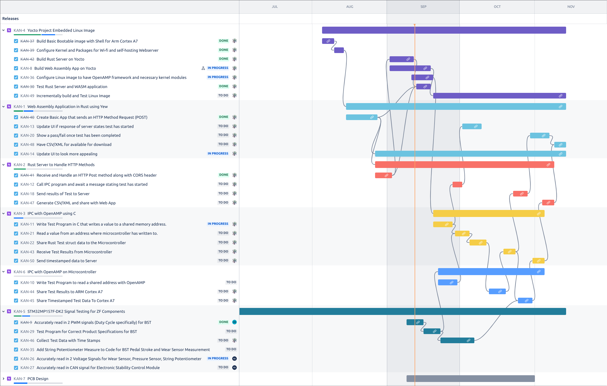
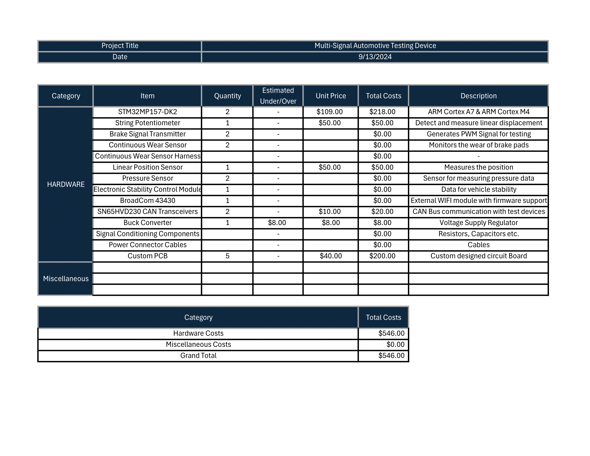

----
marp: true
theme: uncover
backgroundColor: black
color: cyan
paginate: true  # Optional: Add page numbers
style: |
  .columns {
    display: grid;
    grid-template-columns: repeat(2, minmax(0, 1fr));
    gap: 1rem;
  }
  section {
    font-size: 18px;
  }
  h1 {
    font-size: 28px;
  }
  h2 {
    font-size: 24px;
  }
  h3 {
    font-size: 22px;
  }

----
# ECE4820 Senior Design II: 
# Progress Report, Gantt Chart, and Budget Projection

## Members
- Dylan-Matthew Garza
- Daniel Baker
- Rohullah Sah

## Advisor
 Dr. Janos Grantner

## Sponsor

 ZF Group

**Date**: September 13 2024

----

# Gantt Chart (Tentative)

----

# Budget Projections (Tentative)

----

# Progress Report - Rohullah Sah

## Project Status

- On Schedule
- Schematic Design in Progress

## Current Progress

- Major Components Identified
- Connection Mapping for schematic started
- Datasheet review for propper interfacing (specially regarding voltage)
- Schematic to be done on KiCad

## Challenges 

- Custom Components required due to KiCad's library

## Next Steps

- Finalize schematic design
- Begin PCB layout 
- Ensure accurate readings

----

# Progress Report - Daniel Baker

## Prototyping Circuit Design

- Created Circuits to simulate the Electronic Control Unit (ECU) of ZF Group's Braking System
    - Created circuits to read in Brake Signal Transmitter, Pressure Sensor, String Potentiometer, Continuous Wear Sensor, and Electronic Statbility Control (ESC) Module
    - Developed code for the input signals of these sensors to read according to the product specifications of each component
    - Originally read through STM32F4 Discovery Board, replaced it with STM32MP157 Discovery Board
    - Custom PCB design for the STM32MP157 Discovery Board to be used in the final product
- Test code for the components to read the signals and share the data to the Cortex-A7 processor in progress
    - Shared data will be displayed via a web interface using the components of the project developed by Dylan-Matthew Garza

## Printed Circuit Board (PCB) Design
- Initialized PCB design for components being used from the STM32MP157 Discovery Board
- Components include: 
    - STM32MP157FAC1 microprocessor with specified peripherals, and the necessary power supply components
    - STPMIC1APQR power management IC
    - MT41K256M16TW-107-P-V00H DDR3L SDRAM

## In Progress
- Finalizing Custom PCB design for the STM32MP157 Discovery Board and ECU simulation circuits
- Developing test code for the components to read the signals and share the data to the Cortex-A7 processor

    

----

# Progress Report - Dylan-Matthew Garza (1/2)

## Embedded Linux

- Built Minimal Custom Bootable Image (per required software)
    - Wi-fi kernel module and firmware modules
    - nginx webserver and wpa\_supplicant (802.11 supplicant)
    - Command line tools and service manager (systemd and busybox)

## Web Assembly Application

- Done completely in Rust using the Yew framework (no HTML written in index.html beyond header informaton)
- Basic Interactivity 
    - Allows Selection of Test Devices
    - Sends HTTP Method POST Request to server
    - Sends a Rust Struct `TestData` in form of a serialized JSON

## Rust Backend Server

- Handles CORS (Cross-Origin Resource Sharing) preflight request
- Asynchronously awaits for a POST method
    - Deserializes JSON and saves into its own `TestData` Struct
    - Responds with a return code `0` to web application once
    received

----

# Progress Report - Dylan-Matthew Garza (2/2)

## In Progress

- Properly configure and compile rpmsg and remoteproc kernel modules and firmware for IPCC (Inter-Processor communication controller)
    - Necessary for OpenAMP framework
- Write C program that uses rpmsg to talk to Arm Cortex-M4 from
Linux

----

# Web Assembly Application and Rust Server interaction On Custom Linux Image
<video controls width="80%" src="../Demo_Videos/wasm-rs.mp4"></video>

